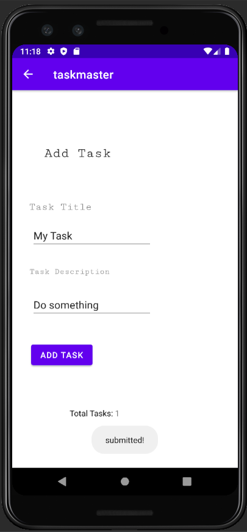
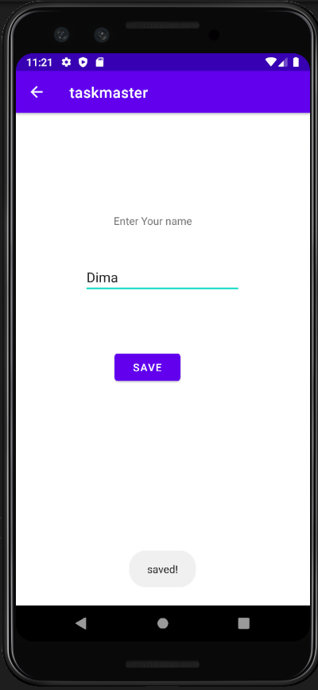

# Task Master
Task Master is an android application for android users to manage their tasks. 

--------
## Lab26:
* At the home page when user click on Add Tasks button will navigate him to Add Task page to add titel and description of the task.
* when the user Click on submit button in Add Task page will showed him label "Submitted!" and the Total tasks will increased by one.  
* At the home page when user click on All Tasks button will navigate him to All Task page.

## The pages

* Home page

* The Add Task

* The All Tasks

## Lab27:
* At Task Detail page have changable title and lourm ipsom as description.
* Update the home page to contain three buttons each button will display different title in Task Detail page. Also there is Setting button which navigate you to Setting page.
* At Setting page allow users to enter their username and hit save. When they go back to home page will see the username  above the three task buttons.
## The pages

* Setting page

* Home page showed the username that saved in setting page

* TaskDetails page when click button1 from home page

* TaskDetails page when click button2 from home page

* TaskDetails page when click button3 from home page

