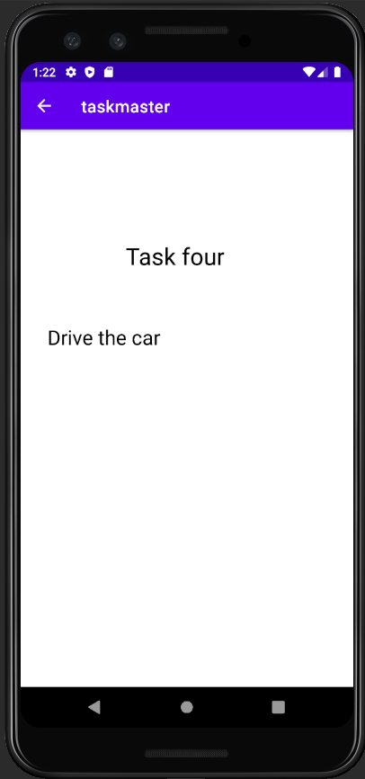
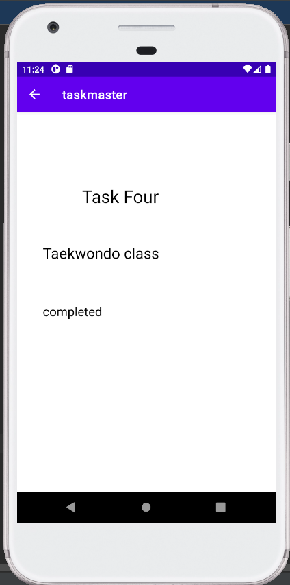
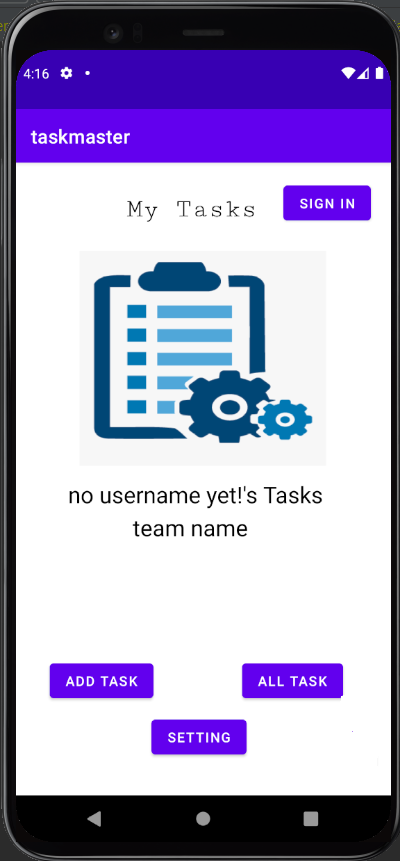
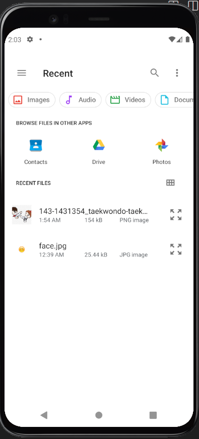

# Task Master
Task Master is an android application for android users to manage their tasks. 

--------
## Lab26:
* At the home page when user click on Add Tasks button will navigate him to Add Task page to add titel and description of the task.
* when the user Click on submit button in Add Task page will showed him label "Submitted!" and the Total tasks will increased by one.  
* At the home page when user click on All Tasks button will navigate him to All Task page.

## The pages

* Home page

* The Add Task

* The All Tasks

------
## Lab27:
* At Task Detail page have changable title and lourm ipsom as description.
* Update the home page to contain three buttons each button will display different title in Task Detail page. Also there is Setting button which navigate you to Setting page.
* At Setting page allow users to enter their username and hit save. When they go back to home page will see the username  above the three task buttons.
## The pages

* Setting page

* Home page showed the username that saved in setting page

* TaskDetails page when click button1 from home page

* TaskDetails page when click button2 from home page

* TaskDetails page when click button3 from home page

----------

## Lab28:
* Add the Task model class which contain the title, body and state.
* Update the home page to contain  Recycle View.
* when the user click on each task at the Recycle View that is appear on home page will navigate him to Task Detail page. 
* At Task Detail page have changable title and body based on which task clicked.

## The pages
*  Home page update

* TaskDetails page when click on task one from home page.

* TaskDetails page when click on task two from home page.

* TaskDetails page when click on task three from home page.

* TaskDetails page when click on task four from home page.

## Lab29:
* Modify on Add Task page to save the data entered in as a Task in the local database.
* Add the Task model class which contain the title, body and state.
* Update the home page to display  all Task entities in Recycle View.
* when the user click on each task at the Recycle View that is appear on home page will navigate him to Task Detail page. 
* At Task Detail page displayed the title,description and status of a tapped task.

## The pages
*  Home page update

* Add task page , Add First task

* TaskDetails page when click on First task from home page.

* TaskDetails page when click on Task two from home page.

* TaskDetails page when click on Task three from home page.

## Lab: 32 - Amplify and DynamoDB
* Using the `amplify add api command`, create a Task resource that replicates our existing Task schema.
* Update all references to the Task data to instead use AWS Amplify to access your data in DynamoDB instead of in Room.
* Modify Add Task Page - When add the Task and Click Add Task button will save the data entered in as a Task to DynamoDB.
* Refactor Home Page RecyclerView to display all Task entities in DynamoDB.

* Home Page after add four tasks

* Add Task Page - here can entered the tasks and will added to data base.

* Task Details page - when users clicked on any task fom RecyclerView (At home page) it will display in this page

## Lab33
* Create a second Model Called a Team, Create relation between Task and Team (Update your tasks to be owned by a team).
* create three teams  Manually.
* Modify the add Task Page to include Radio Buttons for which team that task belongs to.
* Modify Settings page to allow the user to choose their team
* display only that team’s tasks on the homepage.

* Add Task Page - When user add the task have to choose on of the three team's which team that task will be belongs to.

* Setting Page - user can add user name and select their team .
 

* Home Page - will display the team name that the user selected from setting and display the tasks belongs to it.

## Lab36 -
* Add Cognito to Amplify setup. Add in user login and sign up flows to the application.
* Display the logged in user’s username in Home Page.
* Allow users to log out of your application.

* At home page - have Login button directed you to sign up and login flow 

* after sign in the button at home page converted to sign out to allow users to log out of application.

# Lab 37 - S3 Uploads
* On Add Task activity, allow users to optionally select a file to attach to that task. 
* When a user attaches a file to a task, that file should be uploaded to S3, and associated with that task.

* Update Add Task page 

* When click on upload file button will navigate you to select file:

* Home page that consist the tasks, when you cklick any task will navigate you to /task details page.

* the uploded file displayed in task details for specific task.

# Lab: 41 - Intent Filters
Add an intent filter to your application such that a user can hit the “share” button on an image in another application,
choose TaskMaster as the app to share that image with, and be taken directly to the Add a Task activity with that image pre-selected.

* Add Task page

# Lab: 42 - Location
* Update Task schema to be included with location.
* When the user adds a task, their location will be retrieved and included in the Task details page.

* Task Details page

